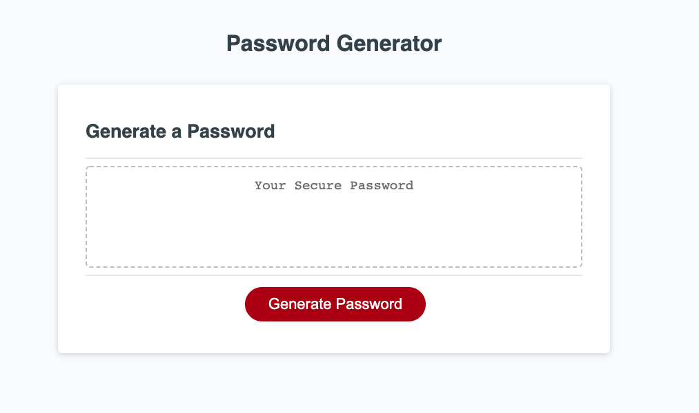

# Password Generator
An application that generates a random password based on entered criteria

## table of contents 
- [Purpose](#purpose)
- [Technologies-Used](#Technologies-Used)
- [Getting-started](#Getting-started)
- [Deployed-app](#deployed-app)
- [Contact](#Contact)

## Purpose 
An application that users can use to generate a random passowrd based on criteria selected by the user. The app runs in the browser and features dynamically updates HTMl and CSS powered by Javascript. 

## Technologies-Used
- Javascript
- HTML
- CSS

## Getting-started
If you would like to run the application from your desktop simply `clone` the code and open the HTML page in your default browser. 

## Deployed-app
The app was deployed on [Github](https://github.com/) and can be viewed at the following link
https://araceli4690.github.io/Password-Generator/

- sample of page

## Contact
If you have any questions feel free to contact me through my [Github](https://github.com/Araceli4690).
